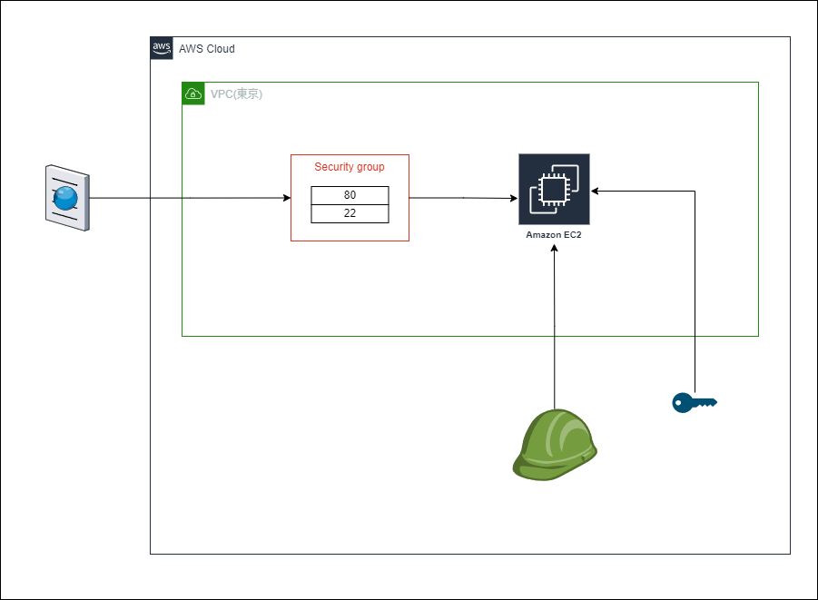

# EC2インスタンス作成のCKDサンプルアプリ

## インフラ



## インスタンスへの接続

### EC2 Instance Connect

> [EC2 Instance Connect を使用して接続](https://docs.aws.amazon.com/ja_jp/AWSEC2/latest/UserGuide/ec2-instance-connect-methods.html)

1. AWS Consoleから接続
2. EC2 Instance Connect CLI

    ```bash
    mssh instance_id
    ```

### セッションマネージャー

> [Session Manager を通して SSH 接続のアクセス許可を有効にして制御する](https://docs.aws.amazon.com/ja_jp/systems-manager/latest/userguide/session-manager-getting-started-enable-ssh-connections.html)

1. AWS Consoleから接続
2. EC2 Instance Connect CLI

    ```bash
    aws ssm start-session --target instance-id
    ```

### SSH クライアント

通常なSSHの接続です。

### EC2 シリアルコンソール

シリアルコンソールに接続したら、起動、ネットワーク設定、およびその他の問題のトラブルシューティングに使用できます。

## おまけ

### Session Manager経由でSSH接続 

1. SSH Config コンフィグ

    > ~/.ssh/config
    
    ```text
    # SSH over Session Manager
    host i-* mi-*
        ProxyCommand sh -c "aws ssm start-session --target %h --document-name AWS-StartSSHSession --parameters 'portNumber=%p'"
    ```

2. 認証キーの取得

    ```bash
    # CFnの出力情報を参照してください。
    aws ssm get-parameter --name /ec2/keypair/key-06503a0da556dfad8 --region ap-northeast-1 --with-decryption --query Parameter.Value --output text > ~/.ssh/gekal.ppk
    # モードを400にする必要がある
    chmod 400 ~/.ssh/gekal.ppk
    ```

3. SSH接続

    ```bash
    # モードを400にする必要がある
    # chmod 400 ~/.ssh/gekal.ppk
    ssh -i ~/.ssh/gekal.ppk ec2-user@instance-id
    ```

### Session ManagerのポートフォワードでVSCode接続

1. SSH Config コンフィグ

    > ~/.ssh/config
    
    ```text
    Host ec2
        HostName localhost
        User ec2-user
        Port 10022
        IdentityFile ~/.ssh/gekal.ppk
    ```

2. 認証キーの取得

    ```bash
    # CFnの出力情報を参照してください。
    aws ssm get-parameter --name /ec2/keypair/key-06503a0da556dfad8 --region ap-northeast-1 --with-decryption --query Parameter.Value --output text > ~/.ssh/gekal.ppk
    # モードを400にする必要がある
    chmod 400 ~/.ssh/gekal.ppk
    ```

3. ポートフォワード開始

    ```bash
    aws ssm start-session --target instance-id --document-name AWS-StartPortForwardingSession --parameters '{"portNumber":["22"],"localPortNumber":["10022"]}'
    ```

4. Connect to Host...

    VS Code から接続します。

## 参照

1. [AWS CDKでEC2のキーペアを作成してみた](https://dev.classmethod.jp/articles/build-ec2-key-pair-with-aws-cdk/)
